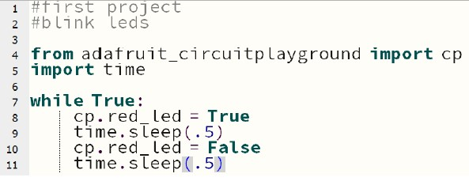
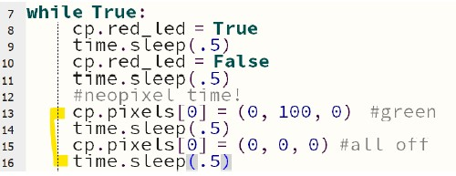
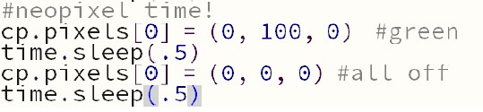

# First Code on the CPX

### Introduction

The purpose of this lab is to introduce some of the specific capabilities of the Circuit Playground
Bluefruit(CPX) which we will use to demonstrate physical computing concepts as part of
learning Python. Also, this lab is concerned about how to save and manage files on the CPX.

### Lab Procedure

#### Part 1
- Connect you CPX to your computer
- Open your Mu editor
- Create a new file
- Create a program which flashes the red LED  

- Save it on your CPX as ‘first project’
  - Use this area to contain your code for this file
- Open the file ‘code.py’
- Delete all the code in ‘code.py’
- Copy/Paste the code from your ‘first project’ file into the ‘code.py’ screen
  - A quick suggestion using keyboard shortcuts
    - In your original code screen do the following: <Ctrl>a then <Ctrl>c
    - Switch to the ‘code.py’ screen and then do: <Ctrl>a then <Ctrl>v
- Save the contents in ‘code.py’
- Assuming there are no errors in your code you should see the red LED flashing

#### Part 2

Now that you have a flashing red LED lets add one of the neopixels
- Add the highlight code to your file in ‘first project’
- Save and the copy/paste to ‘code.py’  
  
- Save ‘code.py’
- You should now see the first neopixel blinking red as well as the red LED

#### Furthuring Your Knowledge
- Note the values being assigned to the first (0) neopixel  

- This is called a tuple in Python and will be discussed in a later chapter
  - However! The three numbers inside the parentheses are RGB values in that order!
  - The values range from 0 to 255 for each color
- Change the color values for the first neopixel to something other than red
- Add another neopixel so that you will have three flashing lights
  - Red LED, the first neopixel and then finally the one you choose
  - The color of the second neopixel should be different from the first
- Save your working code in ‘first project’
- Copy and paste the code ‘code.py’

### Submit Your Assignment
Save a copy of your final code.py in your repo. Add, Commit, and Push your final code to Github
